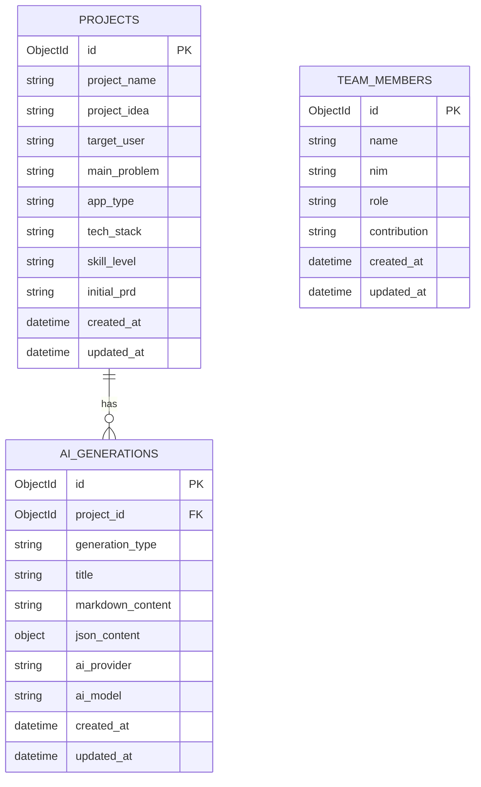

# PRD: VibePlan AI

## 1. Overview

### 1.1 Product Name
**VibePlan AI**

### 1.2 Product Description
VibePlan AI adalah web application berbasis AI yang membantu pemula coding menyusun rencana pengembangan aplikasi secara terstruktur. Aplikasi ini tidak hanya menghasilkan PRD, tetapi juga membantu user memahami langkah setelah PRD dibuat, seperti menyusun task development, membuat prompt untuk coding agent, merancang struktur folder, membuat database/ERD, menyusun API endpoint, testing checklist, deployment guide, dan README.

Aplikasi ini ditujukan untuk pemula yang ingin membangun aplikasi menggunakan pendekatan vibe coding dengan bantuan AI tools seperti Codex, Claude Code, Copilot, OpenCode, Antigravity, Cursor, dan tools sejenis.

### 1.3 Background
Banyak pemula ingin membuat aplikasi dengan bantuan AI, tetapi sering mengalami kendala karena tidak memiliki perencanaan yang jelas. Mereka biasanya langsung meminta AI untuk membuat kode tanpa PRD, tanpa requirement yang terstruktur, tanpa pembagian task, dan tanpa memahami urutan pengerjaan. Hal ini menyebabkan project mudah berantakan, fitur tidak konsisten, struktur folder tidak rapi, dan hasil coding sulit dikembangkan.

VibePlan AI hadir sebagai solusi untuk membantu pemula mengubah ide mentah menjadi dokumen pengembangan yang siap digunakan oleh coding agent.

### 1.4 Problem Statement
Pemula coding sering kesulitan menentukan struktur program, requirement, fitur utama, alur user, arsitektur, ERD, dan tahapan development sebelum mulai membuat aplikasi. Akibatnya, penggunaan AI coding tools menjadi kurang efektif karena input/prompt yang diberikan terlalu umum dan tidak terarah.

### 1.5 Solution
VibePlan AI menyediakan generator berbasis AI yang dapat menghasilkan dokumen teknis dan panduan development dari input ide atau PRD awal user. Semua hasil generate dapat disimpan ke database, dilihat ulang melalui halaman history, dan diunduh dalam format `.md` agar bisa langsung digunakan di Codex, Claude Code, Copilot, OpenCode, Antigravity, Cursor, dan AI coding tools lainnya.

### 1.6 Target Users
- Mahasiswa pemula yang sedang membuat project kuliah.
- Pemula coding yang ingin membuat aplikasi secara terstruktur.
- Pengguna vibe coding yang membutuhkan prompt dan dokumen teknis.
- Tim kecil yang ingin membagi task development.
- Pelajar atau developer junior yang ingin memahami workflow pembuatan aplikasi.

### 1.7 Main Goals
- Membantu pemula membuat PRD yang rapi dan siap digunakan.
- Membantu user memahami langkah setelah PRD dibuat.
- Membantu user membuat prompt yang lebih tepat untuk coding agent.
- Menyediakan penyimpanan hasil generate agar bisa dilihat kembali.
- Menyediakan fitur download `.md` untuk dokumentasi dan input coding agent.

---

## 2. Requirements

### 2.1 Functional Requirements

#### FR-001: Generate PRD
Sistem harus dapat menghasilkan PRD berdasarkan input user. PRD wajib memiliki 8 bagian utama:
1. Overview
2. Requirements
3. Core Features
4. User Flow
5. Architecture
6. Design & Technical Constraints
7. Entity Relationship Diagram (ERD)
8. Development Phases

#### FR-002: Generate Next Step Planner
Sistem harus dapat menghasilkan langkah-langkah setelah PRD dibuat, seperti validasi scope, setup repository, setup frontend, setup backend, setup database, testing, dan deployment.

#### FR-003: Generate Task Breakdown
Sistem harus dapat memecah PRD menjadi task kecil yang mudah dikerjakan pemula, lengkap dengan prioritas, kategori, dan estimasi pengerjaan.

#### FR-004: Generate Coding Prompt
Sistem harus dapat menghasilkan prompt siap pakai untuk coding agent seperti Codex, Claude Code, Copilot, OpenCode, Antigravity, dan Cursor.

#### FR-005: Generate Folder Structure
Sistem harus dapat menghasilkan struktur folder project berdasarkan tech stack yang dipilih user.

#### FR-006: Generate Database & ERD
Sistem harus dapat menghasilkan rancangan database, collection/tabel, relasi, dan ERD dalam format Mermaid.

#### FR-007: Generate API Endpoint
Sistem harus dapat menghasilkan rancangan API endpoint lengkap dengan method, endpoint, request body, response body, dan fungsi endpoint.

#### FR-008: Generate Testing Checklist
Sistem harus dapat menghasilkan checklist testing untuk frontend, backend, database, AI integration, dan deployment.

#### FR-009: Generate Deployment Guide
Sistem harus dapat menghasilkan panduan deployment sesuai stack yang dipilih.

#### FR-010: Generate README
Sistem harus dapat menghasilkan README project otomatis berdasarkan hasil generate.

#### FR-011: Save AI Generation Result
Sistem harus dapat menyimpan semua hasil generate AI ke MongoDB.

#### FR-012: View History
Sistem harus menyediakan halaman history untuk melihat daftar hasil generate sebelumnya.

#### FR-013: View Detail History
Sistem harus menyediakan halaman detail untuk membuka kembali hasil generate secara lengkap.

#### FR-014: Download Markdown
Sistem harus menyediakan fitur download hasil generate dalam format `.md`.

#### FR-015: Delete History
Sistem harus menyediakan fitur hapus hasil generate dari history.

#### FR-016: Filter History
Sistem harus menyediakan filter history berdasarkan generation type, seperti PRD, Next Step, Coding Prompt, ERD, dan lainnya.

#### FR-017: About Team Page
Sistem harus menyediakan halaman identitas tim yang berisi nama anggota, NIM, role, dan kontribusi.

---

### 2.2 Non-Functional Requirements

#### NFR-001: Responsiveness
Website harus responsif dan dapat digunakan pada desktop, tablet, dan mobile browser.

#### NFR-002: Security
API key Groq/OpenRouter tidak boleh disimpan di frontend dan tidak boleh di-commit ke repository. API key wajib disimpan di file `.env` backend Laravel.

#### NFR-003: Performance
Response AI harus ditampilkan dengan loading state agar user memahami bahwa proses generate sedang berjalan.

#### NFR-004: Usability
UI harus sederhana, jelas, dan mudah dipahami pemula.

#### NFR-005: Maintainability
Kode harus dipisahkan berdasarkan tanggung jawab, seperti controller, service, model, route, dan component.

#### NFR-006: Scalability
Struktur database harus fleksibel agar dapat menyimpan banyak jenis hasil generate AI.

#### NFR-007: Reliability
Jika AI API gagal merespons, sistem harus menampilkan pesan error yang mudah dipahami user.

#### NFR-008: Documentation
Project harus memiliki README, dokumentasi API, struktur database, dan panduan menjalankan project.

---

### 2.3 User Requirements
- User dapat mengisi ide aplikasi atau PRD awal.
- User dapat memilih jenis generate yang diinginkan.
- User dapat melihat hasil generate secara rapi.
- User dapat menyimpan hasil generate.
- User dapat membuka ulang hasil generate.
- User dapat download hasil generate sebagai file `.md`.
- User dapat menggunakan file `.md` ke coding agent.

---

### 2.4 System Requirements

#### Frontend
- Next.js
- Tailwind CSS
- Axios atau Fetch API
- React Markdown untuk preview markdown
- Mermaid renderer jika ingin menampilkan ERD secara visual

#### Backend
- Laravel
- Laravel API routes
- MongoDB Laravel package
- HTTP Client untuk request ke Groq/OpenRouter
- CORS configuration

#### Database
- MongoDB Atlas atau MongoDB lokal
- Collection utama:
  - `projects`
  - `ai_generations`
  - `team_members`

#### AI Provider
- Groq API atau OpenRouter API
- API key disimpan di `.env`

---

## 3. Core Features

### 3.1 AI PRD Generator
Fitur untuk menghasilkan PRD lengkap berdasarkan input user.

#### Input
- Project name
- Project idea
- Target user
- Main problem
- App type
- Tech stack
- Skill level
- Initial PRD/notes

#### Output
- Overview
- Requirements
- Core Features
- User Flow
- Architecture
- Design & Technical Constraints
- ERD
- Development Phases

---

### 3.2 AI Next Step Planner
Fitur untuk menghasilkan panduan langkah setelah PRD dibuat.

#### Output Example
1. Validasi scope project.
2. Tentukan MVP.
3. Buat repository GitHub.
4. Setup frontend Next.js.
5. Setup backend Laravel.
6. Setup MongoDB.
7. Buat endpoint generate AI.
8. Integrasikan frontend dengan backend.
9. Simpan hasil ke database.
10. Lakukan testing.
11. Deploy project.
12. Buat README dan video demo.

---

### 3.3 AI Task Breakdown Generator
Fitur untuk memecah PRD menjadi task kecil.

#### Output Example
| Task | Category | Priority | Estimated Time |
|---|---|---|---|
| Setup Next.js project | Frontend | High | 30 minutes |
| Setup Laravel API | Backend | High | 45 minutes |
| Configure MongoDB | Database | High | 45 minutes |
| Create generate form | Frontend | High | 1 hour |
| Create AI service | Backend | High | 1 hour |
| Save result to MongoDB | Backend | High | 1 hour |
| Create history page | Frontend | Medium | 1 hour |

---

### 3.4 AI Coding Prompt Generator
Fitur untuk menghasilkan prompt coding agent.

#### Output
- Prompt for Codex
- Prompt for Claude Code
- Prompt for Copilot
- Prompt for OpenCode/Antigravity
- Prompt per fitur agar task tidak terlalu besar

---

### 3.5 AI Folder Structure Generator
Fitur untuk menghasilkan struktur folder project.

#### Output Example
```text
vibeplan-ai/
├── frontend-next/
│   ├── app/
│   ├── components/
│   ├── services/
│   ├── utils/
│   └── package.json
├── backend-laravel/
│   ├── app/
│   ├── routes/
│   ├── config/
│   └── composer.json
├── docs/
└── README.md
```

---

### 3.6 AI Database & ERD Generator
Fitur untuk menghasilkan database schema dan ERD.

#### Output
- Collection list
- Field list
- Relationship explanation
- Mermaid ERD
- MongoDB document example

---

### 3.7 AI API Endpoint Generator
Fitur untuk menghasilkan rancangan endpoint backend.

#### Output Example
| Method | Endpoint | Description |
|---|---|---|
| POST | `/api/generate/prd` | Generate PRD |
| POST | `/api/generate/next-step` | Generate next step |
| POST | `/api/generate/task-breakdown` | Generate task breakdown |
| POST | `/api/generate/coding-prompt` | Generate coding prompt |
| GET | `/api/history` | Get all history |
| GET | `/api/history/{id}` | Get detail history |
| GET | `/api/download/{id}` | Download markdown |
| DELETE | `/api/history/{id}` | Delete history |

---

### 3.8 AI Testing Checklist Generator
Fitur untuk menghasilkan checklist pengujian.

#### Output
- Frontend testing checklist
- Backend testing checklist
- Database testing checklist
- AI API testing checklist
- Deployment testing checklist

---

### 3.9 AI Deployment Guide Generator
Fitur untuk menghasilkan panduan deployment.

#### Output
- Frontend deployment guide
- Backend deployment guide
- Environment variable setup
- Database setup
- Post-deployment testing

---

### 3.10 History & Detail Result
Fitur untuk menyimpan dan menampilkan ulang semua hasil generate.

---

### 3.11 Markdown Download
Fitur untuk mengunduh hasil generate sebagai file `.md`.

---

## 4. User Flow

### 4.1 Main User Flow
```text
User membuka Landing Page
↓
User klik Get Started
↓
User masuk ke Dashboard
↓
User memilih Generate
↓
User mengisi form project
↓
User memilih jenis generate
↓
User klik Generate
↓
Frontend mengirim data ke Laravel API
↓
Laravel memvalidasi data
↓
Laravel membuat prompt berdasarkan generation type
↓
Laravel mengirim request ke Groq/OpenRouter
↓
AI menghasilkan markdown dan JSON
↓
Laravel menyimpan hasil ke MongoDB
↓
Laravel mengirim response ke Next.js
↓
Next.js menampilkan hasil generate
↓
User bisa download .md atau membuka history
```

### 4.2 PRD Generation Flow
```text
Input ide aplikasi
↓
Pilih Generate Type: PRD
↓
AI membuat PRD 8 section
↓
Hasil tampil di Result Page
↓
Hasil tersimpan ke MongoDB
↓
User download prd.md
```

### 4.3 Next Step Flow
```text
User memilih project/PRD yang sudah dibuat
↓
Pilih Generate Next Step
↓
AI membaca konteks PRD
↓
AI membuat langkah pengerjaan setelah PRD
↓
Hasil tersimpan sebagai next_step
```

### 4.4 History Flow
```text
User membuka History Page
↓
Sistem mengambil data dari MongoDB
↓
User memilih salah satu hasil generate
↓
Sistem membuka Detail History Page
↓
User dapat membaca, copy, download, atau delete
```

### 4.5 Download Flow
```text
User klik Download .md
↓
Frontend memanggil endpoint download
↓
Laravel mengambil markdown_content dari MongoDB
↓
Laravel mengirim file .md
↓
Browser mendownload file
```

---

## 5. Architecture

### 5.1 System Architecture
```text
Browser/User
↓
Next.js Frontend
↓
Laravel REST API
↓
AI Service Layer
↓
Groq/OpenRouter API
↓
Laravel receives AI response
↓
MongoDB stores generation result
↓
Next.js displays result/history
```

### 5.2 Frontend Architecture
Frontend menggunakan Next.js dengan App Router.

#### Main Pages
```text
app/
├── page.jsx
├── dashboard/
│   └── page.jsx
├── generate/
│   └── page.jsx
├── result/
│   └── [id]/
│       └── page.jsx
├── history/
│   └── page.jsx
├── history/
│   └── [id]/
│       └── page.jsx
└── about-team/
    └── page.jsx
```

#### Components
```text
components/
├── common/
│   ├── Button.jsx
│   ├── Input.jsx
│   ├── Textarea.jsx
│   ├── Select.jsx
│   └── Loading.jsx
├── layout/
│   ├── Navbar.jsx
│   ├── Sidebar.jsx
│   └── Footer.jsx
├── generator/
│   ├── GeneratorForm.jsx
│   ├── GenerationTypeSelector.jsx
│   ├── ResultViewer.jsx
│   └── DownloadButton.jsx
└── history/
    ├── HistoryCard.jsx
    ├── HistoryFilter.jsx
    └── HistoryList.jsx
```

### 5.3 Backend Architecture
Backend menggunakan Laravel sebagai REST API.

#### Main Structure
```text
backend-laravel/
├── app/
│   ├── Http/
│   │   ├── Controllers/
│   │   │   ├── GenerateController.php
│   │   │   ├── HistoryController.php
│   │   │   ├── ProjectController.php
│   │   │   └── TeamMemberController.php
│   │   └── Requests/
│   │       └── GenerateRequest.php
│   ├── Models/
│   │   ├── Project.php
│   │   ├── AiGeneration.php
│   │   └── TeamMember.php
│   └── Services/
│       ├── AiService.php
│       ├── PromptService.php
│       ├── MarkdownService.php
│       └── HistoryService.php
├── routes/
│   └── api.php
└── config/
```

### 5.4 API Architecture
Laravel API menyediakan endpoint untuk generate, history, download, dan team member.

#### Generate Endpoints
```text
POST /api/generate/prd
POST /api/generate/next-step
POST /api/generate/task-breakdown
POST /api/generate/coding-prompt
POST /api/generate/folder-structure
POST /api/generate/database-erd
POST /api/generate/api-endpoint
POST /api/generate/testing-checklist
POST /api/generate/deployment-guide
POST /api/generate/readme
```

#### History Endpoints
```text
GET /api/history
GET /api/history/{id}
GET /api/history/project/{projectId}
GET /api/download/{id}
DELETE /api/history/{id}
```

### 5.5 AI Integration Architecture
AI key wajib disimpan di file `.env` Laravel.

#### Environment Variable Example
```env
AI_PROVIDER=groq
GROQ_API_KEY=your_groq_api_key_here
GROQ_BASE_URL=https://api.groq.com/openai/v1
GROQ_MODEL=llama-3.1-8b-instant

OPENROUTER_API_KEY=your_openrouter_api_key_here
OPENROUTER_BASE_URL=https://openrouter.ai/api/v1
OPENROUTER_MODEL=meta-llama/llama-3.1-8b-instruct
```

> Important: Never commit real API keys to GitHub. If an API key has been exposed publicly or pasted into a chat, rotate/regenerate it immediately.

### 5.6 Database Architecture
Database menggunakan MongoDB karena hasil AI berbentuk dokumen fleksibel, seperti markdown, JSON, array requirement, array task, dan Mermaid ERD.

Collections:
```text
projects
ai_generations
team_members
```

---

## 6. Design & Technical Constraints

### 6.1 Design Constraints
- UI harus sederhana dan mudah dipahami pemula.
- Tampilan harus responsif di desktop dan mobile.
- Gunakan card layout untuk menampilkan tipe generator.
- Gunakan sidebar atau navbar untuk navigasi utama.
- Gunakan preview markdown agar hasil generate mudah dibaca.
- Gunakan loading state saat AI sedang generate.
- Gunakan empty state jika belum ada history.

### 6.2 Technical Constraints
- Frontend wajib menggunakan Next.js.
- Backend wajib menggunakan Laravel sebagai REST API.
- Database menggunakan MongoDB.
- AI provider menggunakan Groq atau OpenRouter.
- API key tidak boleh ditaruh di frontend.
- Semua hasil generate harus disimpan sebagai markdown_content.
- Sistem harus mendukung download `.md`.
- Semua request ke AI dilakukan melalui backend Laravel.
- Gunakan `.env` untuk konfigurasi rahasia.
- Gunakan CORS agar frontend Next.js bisa mengakses Laravel API.

### 6.3 Security Constraints
- Jangan expose API key ke browser.
- Jangan commit `.env` ke GitHub.
- Validasi semua input user di backend.
- Batasi panjang input agar prompt tidak terlalu besar.
- Escape output markdown jika perlu.
- Tambahkan error handling untuk API failure.
- Gunakan `.gitignore` untuk menyembunyikan file sensitif.

### 6.4 Performance Constraints
- Gunakan loading indicator saat request AI berjalan.
- Gunakan pagination atau limit pada halaman history.
- Simpan hasil generate agar user tidak perlu generate ulang.
- Hindari generate terlalu banyak section dalam satu request jika response menjadi terlalu panjang.
- MVP harus memprioritaskan fitur inti.

### 6.5 UX Constraints
- Pemula harus memahami tombol dan alur tanpa membaca dokumentasi panjang.
- Setiap generator harus memiliki deskripsi singkat.
- Hasil generate harus bisa langsung dicopy.
- Hasil generate harus bisa didownload sebagai `.md`.
- Error message harus menggunakan bahasa sederhana.

### 6.6 Project Scope Constraints
Untuk MVP, fitur yang wajib selesai:
1. Generate PRD
2. Generate Next Step Planner
3. Generate Coding Prompt
4. Save to MongoDB
5. History Page
6. Detail History Page
7. Download `.md`
8. About Team Page

Fitur tambahan jika waktu cukup:
1. Task Breakdown
2. Folder Structure
3. Database & ERD
4. API Endpoint
5. Testing Checklist
6. Deployment Guide
7. README Generator

---

## 7. Entity Relationship Diagram (ERD)

### 7.1 Entity Overview

#### projects
Menyimpan data project utama yang dimasukkan user.

#### ai_generations
Menyimpan semua hasil generate AI berdasarkan project.

#### team_members
Menyimpan identitas anggota tim.

---

### 7.2 Mermaid ERD


---

### 7.3 MongoDB Collection Design

#### Collection: projects
```json
{
  "_id": "ObjectId",
  "project_name": "VibePlan AI",
  "project_idea": "AI Development Companion untuk pemula coding",
  "target_user": "Pemula coding, mahasiswa, vibe coder",
  "main_problem": "Pemula bingung menentukan struktur program dan langkah development",
  "app_type": "Web Application",
  "tech_stack": "Next.js, Laravel, MongoDB",
  "skill_level": "Beginner",
  "initial_prd": "Catatan awal user atau PRD awal",
  "created_at": "2026-05-23T00:00:00.000Z",
  "updated_at": "2026-05-23T00:00:00.000Z"
}
```

#### Collection: ai_generations
```json
{
  "_id": "ObjectId",
  "project_id": "ObjectId",
  "generation_type": "prd",
  "title": "PRD VibePlan AI",
  "markdown_content": "# PRD: VibePlan AI...",
  "json_content": {
    "overview": {},
    "requirements": {},
    "core_features": {},
    "user_flow": {},
    "architecture": {},
    "design_technical_constraints": {},
    "erd": {},
    "development_phases": {}
  },
  "ai_provider": "groq",
  "ai_model": "llama-3.1-8b-instant",
  "created_at": "2026-05-23T00:00:00.000Z",
  "updated_at": "2026-05-23T00:00:00.000Z"
}
```

#### Collection: team_members
```json
{
  "_id": "ObjectId",
  "name": "Raflian Taofiq Z.M",
  "nim": "24.01.53.0008",
  "role": "Backend & AI Integration",
  "contribution": "Membuat Laravel API, integrasi AI, dan MongoDB"
}
```

---

## 8. Development Phases

### Phase 1: Planning & Setup
#### Goals
Mempersiapkan repository, struktur folder, dan konfigurasi awal project.

#### Tasks
- Buat repository GitHub.
- Buat folder `frontend-next`.
- Buat folder `backend-laravel`.
- Setup Next.js.
- Setup Laravel.
- Setup MongoDB Atlas atau MongoDB lokal.
- Buat file `.env` backend dan `.env.local` frontend.
- Buat README awal.
- Tambahkan `.gitignore`.

#### Output
- Repository siap digunakan.
- Frontend dan backend bisa dijalankan lokal.

---

### Phase 2: Backend Core Development
#### Goals
Membangun backend Laravel sebagai REST API.

#### Tasks
- Setup MongoDB Laravel package.
- Buat model `Project`.
- Buat model `AiGeneration`.
- Buat model `TeamMember`.
- Buat controller `GenerateController`.
- Buat controller `HistoryController`.
- Buat service `AiService`.
- Buat service `PromptService`.
- Buat service `MarkdownService`.
- Buat route API.
- Buat validasi request.

#### Output
- Laravel API siap menerima request dari frontend.
- Backend bisa menyimpan data ke MongoDB.

---

### Phase 3: AI Integration
#### Goals
Menghubungkan Laravel dengan Groq/OpenRouter API.

#### Tasks
- Simpan API key di `.env`.
- Buat fungsi request ke AI provider.
- Buat prompt template untuk PRD.
- Buat prompt template untuk Next Step.
- Buat prompt template untuk Coding Prompt.
- Buat parser response AI.
- Simpan hasil response ke MongoDB.
- Tambahkan error handling jika AI gagal.

#### Output
- Backend bisa menghasilkan output AI.
- Hasil generate tersimpan ke database.

---

### Phase 4: Frontend Core Development
#### Goals
Membangun UI utama dengan Next.js.

#### Tasks
- Buat Landing Page.
- Buat Dashboard Page.
- Buat Generate Page.
- Buat Result Page.
- Buat History Page.
- Buat Detail History Page.
- Buat About Team Page.
- Buat component form generator.
- Buat component result viewer.
- Buat button download markdown.
- Integrasikan API frontend ke Laravel.

#### Output
- User bisa generate hasil AI dari browser.
- User bisa melihat result dan history.

---

### Phase 5: Markdown Download & History
#### Goals
Menyediakan fitur penyimpanan, detail, dan download `.md`.

#### Tasks
- Buat endpoint `GET /api/download/{id}`.
- Ambil `markdown_content` dari MongoDB.
- Kirim response sebagai file `.md`.
- Buat tombol download di frontend.
- Buat fitur copy markdown.
- Buat filter history berdasarkan generation type.
- Buat fitur delete history.

#### Output
- User bisa download hasil generate.
- User bisa membuka ulang hasil generate.

---

### Phase 6: Testing & Bug Fixing
#### Goals
Memastikan aplikasi berjalan stabil untuk demo.

#### Tasks
- Test form generate.
- Test validasi input kosong.
- Test request AI.
- Test error handling jika API gagal.
- Test penyimpanan ke MongoDB.
- Test halaman history.
- Test detail history.
- Test download markdown.
- Test responsive design.
- Test CORS frontend-backend.

#### Output
- Aplikasi siap demo.
- Error utama sudah diperbaiki.

---

### Phase 7: Deployment
#### Goals
Mempersiapkan aplikasi untuk diakses online atau demo lokal.

#### Tasks
- Deploy frontend Next.js ke Vercel.
- Deploy backend Laravel ke Render/Railway/VPS.
- Gunakan MongoDB Atlas untuk database cloud.
- Set environment variable di hosting.
- Test API production.
- Test generate dari frontend production.
- Pastikan API key tidak terekspos.

#### Output
- Aplikasi bisa diakses lewat browser.
- Link project siap dicantumkan di deskripsi YouTube/demo.

---

### Phase 8: Documentation & Presentation
#### Goals
Menyiapkan dokumentasi dan video presentasi.

#### Tasks
- Lengkapi README.
- Buat dokumentasi API.
- Buat dokumentasi database.
- Buat script demo.
- Rekam video demo.
- Jelaskan problem statement.
- Jelaskan fitur AI.
- Jelaskan tech stack.
- Jelaskan alur generate, history, dan download `.md`.
- Cantumkan link GitHub dan link project.

#### Output
- Dokumentasi lengkap.
- Video demo siap dikumpulkan.

---

## Coding Agent Instruction

Use this PRD as the primary development reference for building VibePlan AI.

### Main Tech Stack
- Frontend: Next.js
- Backend: Laravel REST API
- Database: MongoDB
- AI Provider: Groq/OpenRouter
- Output Format: Markdown `.md`

### Development Rules
1. Build the project based on the development phases.
2. Prioritize MVP features first.
3. Do not add unnecessary features outside the PRD.
4. Keep frontend and backend separated.
5. Store all secrets in `.env`.
6. Never expose API keys in frontend code.
7. Store every AI result in MongoDB.
8. Every generation result must have `markdown_content`.
9. Every result should be downloadable as `.md`.
10. Explain every major file created.
11. Run testing after each implementation step.

### MVP Priority
Build these features first:
1. Generate PRD
2. Generate Next Step Planner
3. Generate Coding Prompt
4. Save result to MongoDB
5. History Page
6. Detail History Page
7. Download `.md`
8. About Team Page

### Recommended First Coding Task
Start by creating the Laravel backend API structure:
- `GenerateController`
- `HistoryController`
- `AiService`
- `PromptService`
- `MarkdownService`
- `Project` model
- `AiGeneration` model
- API routes for generate, history, detail, and download.

After backend core is ready, continue with Next.js frontend pages.
