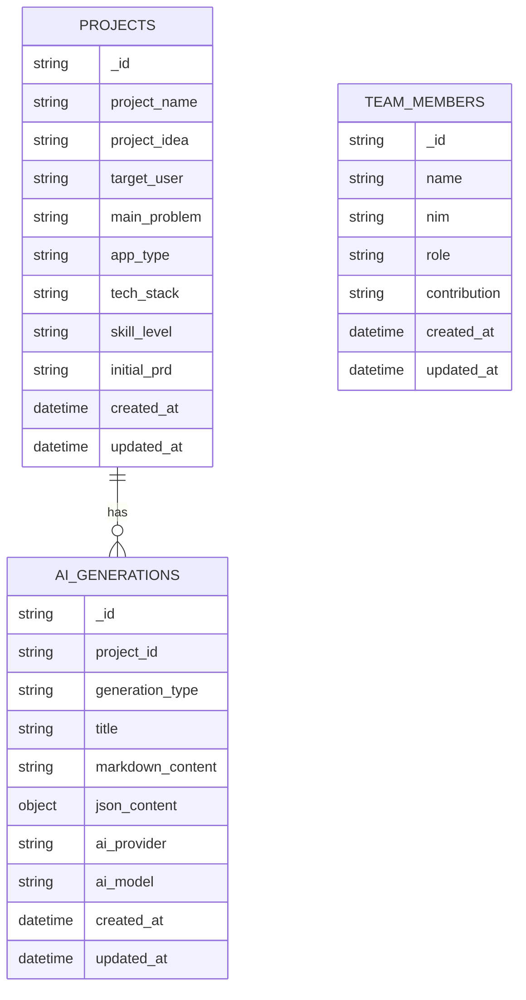

### Overview
#### Project VibePlan AI

VibePlan AI adalah aplikasi web yang membantu pemula membuat PRD dan panduan development. Tujuan utama aplikasi ini adalah untuk membantu pemula dalam menentukan struktur program dan langkah setelah PRD.

#### Target User
Pemula coding dan mahasiswa.

#### Main Problem
Pemula bingung menentukan struktur program dan langkah setelah PRD.

#### MVP Goal
Membuat aplikasi yang dapat menghasilkan PRD, next step, coding prompt, history, dan download markdown.

#### Future Improvement Direction
Melakukan peningkatan dan perbaikan aplikasi berdasarkan umpan balik dari pengguna.

### Requirements

#### Functional Requirements
- Aplikasi dapat menghasilkan PRD.
- Aplikasi dapat menghasilkan next step.
- Aplikasi dapat menghasilkan coding prompt.
- Aplikasi dapat menyimpan dan membaca history.
- Aplikasi dapat mengunduh markdown.

#### Non-Functional Requirements
- Aplikasi harus dapat diakses melalui web.
- Aplikasi harus dapat berjalan pada berbagai jenis perangkat.

#### MVP Scope
- Menggunakan Next.js sebagai frontend.
- Menggunakan Laravel sebagai backend.
- Menggunakan MongoDB sebagai database.
- Menggunakan Groq/OpenRouter AI API.

#### Future Improvements
- Melakukan peningkatan dan perbaikan aplikasi berdasarkan umpan balik dari pengguna.

#### API Endpoint List
- POST /api/generate/prd: Menghasilkan PRD.
- POST /api/generate/next-step: Menghasilkan next step.
- POST /api/generate/coding-prompt: Menghasilkan coding prompt.
- GET /api/history: Mengambil history.
- GET /api/history/{id}: Mengambil history dengan ID tertentu.
- GET /api/download/{id}: Mengunduh markdown dengan ID tertentu.
- DELETE /api/history/{id}: Menghapus history dengan ID tertentu.

### Core Features

#### PRD Generator
- **Summary**: Aplikasi dapat menghasilkan PRD.
- **User Goal**: Membuat PRD.
- **Output**: PRD dalam format markdown.
- **Stored Data**: Menghasilkan PRD dan menyimpannya ke database.
- **Acceptance Criteria**:
  - Pengguna dapat mengisi input PRD.
  - Aplikasi dapat menghasilkan PRD.
  - Aplikasi dapat menyimpan PRD ke database.
  - Pengguna dapat mengunduh PRD dalam format markdown.

#### Next Step Planner
- **Summary**: Aplikasi dapat menghasilkan next step.
- **User Goal**: Membuat next step.
- **Output**: Next step dalam format markdown.
- **Stored Data**: Menghasilkan next step dan menyimpannya ke database.
- **Acceptance Criteria**:
  - Pengguna dapat mengisi input next step.
  - Aplikasi dapat menghasilkan next step.
  - Aplikasi dapat menyimpan next step ke database.
  - Pengguna dapat mengunduh next step dalam format markdown.

#### Coding Prompt Generator
- **Summary**: Aplikasi dapat menghasilkan coding prompt.
- **User Goal**: Membuat coding prompt.
- **Output**: Coding prompt dalam format markdown.
- **Stored Data**: Menghasilkan coding prompt dan menyimpannya ke database.
- **Acceptance Criteria**:
  - Pengguna dapat mengisi input coding prompt.
  - Aplikasi dapat menghasilkan coding prompt.
  - Aplikasi dapat menyimpan coding prompt ke database.
  - Pengguna dapat mengunduh coding prompt dalam format markdown.

#### History Page
- **Summary**: Aplikasi dapat menyimpan dan membaca history.
- **User Goal**: Menyimpan dan membaca history.
- **Output**: Daftar history.
- **Stored Data**: Menyimpan history ke database.
- **Acceptance Criteria**:
  - Pengguna dapat mengisi input history.
  - Aplikasi dapat menyimpan history ke database.
  - Pengguna dapat mengambil history dari database.
  - Pengguna dapat menghapus history dari database.

#### Detail Result Page
- **Summary**: Aplikasi dapat menampilkan hasil detail.
- **User Goal**: Menampilkan hasil detail.
- **Output**: Hasil detail dalam format markdown.
- **Stored Data**: Mengambil hasil detail dari database.
- **Acceptance Criteria**:
  - Pengguna dapat mengambil hasil detail dari database.
  - Pengguna dapat melihat hasil detail dalam format markdown.
  - Pengguna dapat mengunduh hasil detail dalam format markdown.

#### Download Markdown
- **Summary**: Aplikasi dapat mengunduh markdown.
- **User Goal**: Mengunduh markdown.
- **Output**: Markdown dalam format file.
- **Stored Data**: Mengambil markdown dari database.
- **Acceptance Criteria**:
  - Pengguna dapat mengambil markdown dari database.
  - Pengguna dapat mengunduh markdown dalam format file.

#### About Team Page
- **Summary**: Aplikasi dapat menampilkan informasi tentang tim.
- **User Goal**: Menampilkan informasi tentang tim.
- **Output**: Informasi tentang tim.
- **Stored Data**: Mengambil informasi tentang tim dari database.
- **Acceptance Criteria**:
  - Pengguna dapat mengambil informasi tentang tim dari database.
  - Pengguna dapat melihat informasi tentang tim.
  - Pengguna dapat mengunduh informasi tentang tim dalam format file.

### User Flow

1. Pengguna mengisi input PRD.
2. Pengguna mengklik tombol "Generate" untuk menghasilkan PRD.
3. Aplikasi menghasilkan PRD dan menyimpannya ke database.
4. Pengguna dapat melihat hasil detail PRD.
5. Pengguna dapat mengunduh hasil detail PRD dalam format markdown.
6. Pengguna dapat mengisi input next step.
7. Pengguna mengklik tombol "Generate" untuk menghasilkan next step.
8. Aplikasi menghasilkan next step dan menyimpannya ke database.
9. Pengguna dapat melihat hasil detail next step.
10. Pengguna dapat mengunduh hasil detail next step dalam format markdown.
11. Pengguna dapat mengisi input coding prompt.
12. Pengguna mengklik tombol "Generate" untuk menghasilkan coding prompt.
13. Aplikasi menghasilkan coding prompt dan menyimpannya ke database.
14. Pengguna dapat melihat hasil detail coding prompt.
15. Pengguna dapat mengunduh hasil detail coding prompt dalam format markdown.
16. Pengguna dapat mengisi input history.
17. Pengguna mengklik tombol "Save" untuk menyimpan history.
18. Aplikasi menyimpan history ke database.
19. Pengguna dapat mengambil history dari database.
20. Pengguna dapat menghapus history dari database.
21. Pengguna dapat melihat informasi tentang tim.

### Architecture

#### Frontend
- Menggunakan Next.js sebagai framework.
- Menggunakan React sebagai library UI.
- Menggunakan Context API atau local component state untuk manajemen state.

#### Backend
- Menggunakan Laravel sebagai framework.
- Menggunakan MongoDB sebagai database.
- Menggunakan Groq/OpenRouter AI API.

#### History dan Markdown Download Flow
- User input -> Laravel API -> AI provider -> MongoDB -> history -> markdown download

#### Next.js Frontend
- Mengirimkan request hanya ke Laravel API.
- Laravel API mengvalidate input.
- Laravel API membangun prompt.
- Laravel API memanggil Groq/OpenRouter AI API.
- Laravel API menyimpan markdown_content ke MongoDB.
- Frontend membaca history dari Laravel API.
- Download .md disajikan oleh Laravel.

### Design & Technical Constraints

#### Desain
- Aplikasi harus dapat diakses melalui web.
- Aplikasi harus dapat berjalan pada berbagai jenis perangkat.

#### Keterbatasan Teknis
- Tidak boleh ada API keys di frontend.
- Setiap hasil AI harus termasuk markdown_content.
- Semua generasi harus disimpan di MongoDB.
- Frontend dan backend harus tetap terpisah.
- Download output harus .md.
- Route harus tetap bersih dan REST-oriented.

#### Risiko dan Mitigasi
- Risiko: Pengguna tidak dapat mengakses aplikasi karena kesalahan teknis.
- Mitigasi: Melakukan testing dan pengujian secara berkala untuk memastikan aplikasi berjalan dengan baik.

### Entity Relationship Diagram (ERD)

- PROJECTS dan AI_GENERATIONS memiliki hubungan one-to-many.
- TEAM_MEMBERS adalah entitas yang berdiri sendiri dan tidak memiliki hubungan dengan PROJECTS atau AI_GENERATIONS.
- Tipe field harus lengkap dan mengikuti pola yang disebutkan di atas.

### Development Phases

#### Project Setup
- Menginstal dependencies.
- Mengatur struktur project.
- Mengatur konfigurasi database.

**Deliverables/Checkpoints:**

- Project setup berhasil.

#### Laravel Backend API
- Mengembangkan API untuk menghasilkan PRD, next step, dan coding prompt.
- Mengimplementasikan validasi input.
- Mengimplementasikan penyimpanan dan pengambilan data ke database.

**Deliverables/Checkpoints:**

- API untuk menghasilkan PRD, next step, dan coding prompt berhasil.
- Validasi input berhasil.
- Penyimpanan dan pengambilan data ke database berhasil.

#### MongoDB Integration
- Mengintegrasikan MongoDB ke Laravel.
- Mengimplementasikan penyimpanan dan pengambilan data ke MongoDB.

**Deliverables/Checkpoints:**

- MongoDB berhasil diintegrasikan ke Laravel.
- Penyimpanan dan pengambilan data ke MongoDB berhasil.

#### AI Integration
- Mengintegrasikan AI provider ke Laravel.
- Mengimplementasikan penghasilan PRD, next step, dan coding prompt menggunakan AI.

**Deliverables/Checkpoints:**

- AI provider berhasil diintegrasikan ke Laravel.
- Penghasilan PRD, next step, dan coding prompt menggunakan AI berhasil.

#### Next.js Frontend Integration
- Mengembangkan frontend menggunakan Next.js.
- Mengimplementasikan pengirimkan request ke Laravel API.
- Mengimplementasikan pengambilan data dari Laravel API.

**Deliverables/Checkpoints:**

- Frontend menggunakan Next.js berhasil.
- Pengirimkan request ke Laravel API berhasil.
- Pengambilan data dari Laravel API berhasil.

#### Testing, Polish, dan Demo Preparation
- Menguji aplikasi secara berkala untuk memastikan aplikasi berjalan dengan baik.
- Mengembangkan aplikasi untuk memastikan bahwa aplikasi dapat berjalan dengan baik pada berbagai jenis perangkat.
- Mengembangkan aplikasi untuk memastikan bahwa aplikasi dapat berjalan dengan baik pada berbagai versi browser.

**Deliverables/Checkpoints:**

- Aplikasi berhasil diuji secara berkala.
- Aplikasi berhasil dikembangkan untuk memastikan bahwa aplikasi dapat berjalan dengan baik pada berbagai jenis perangkat.
- Aplikasi berhasil dikembangkan untuk memastikan bahwa aplikasi dapat berjalan dengan baik pada berbagai versi browser.
